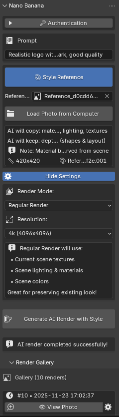
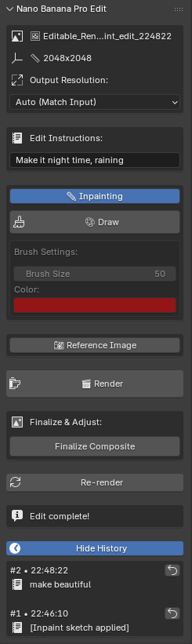
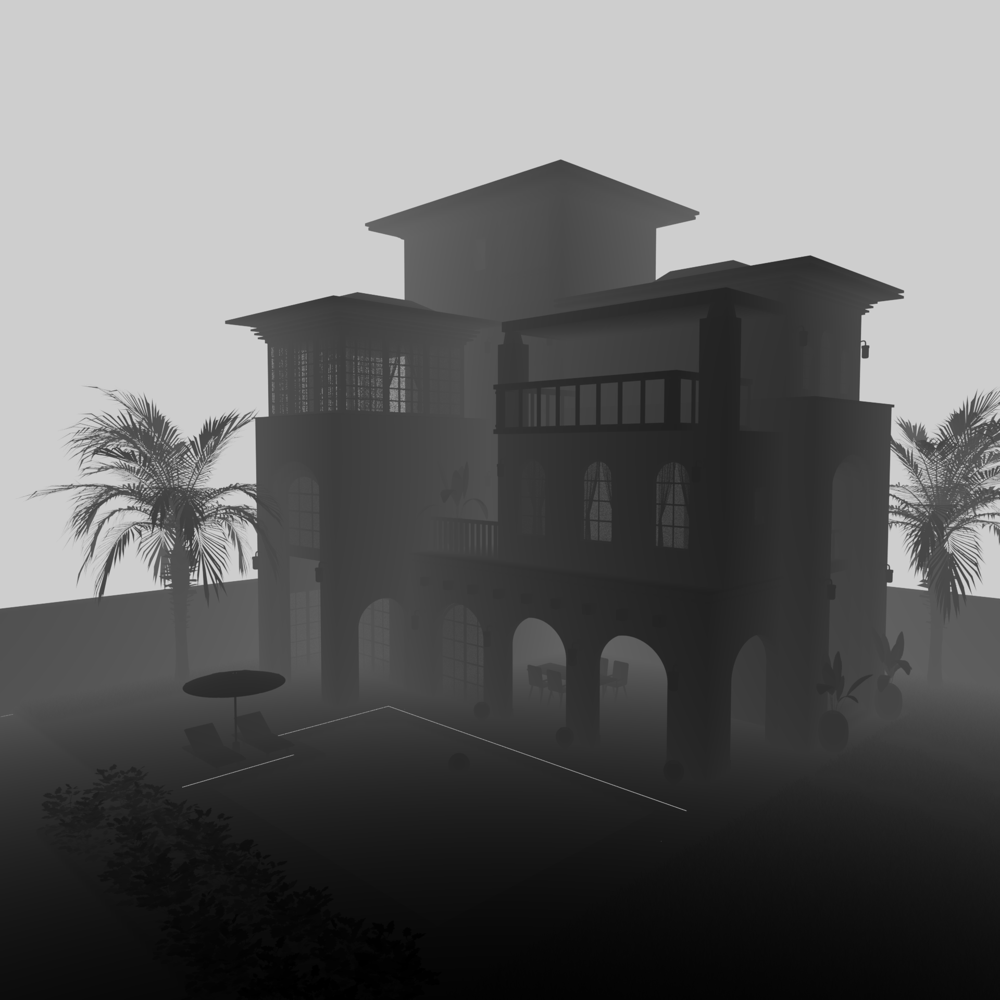
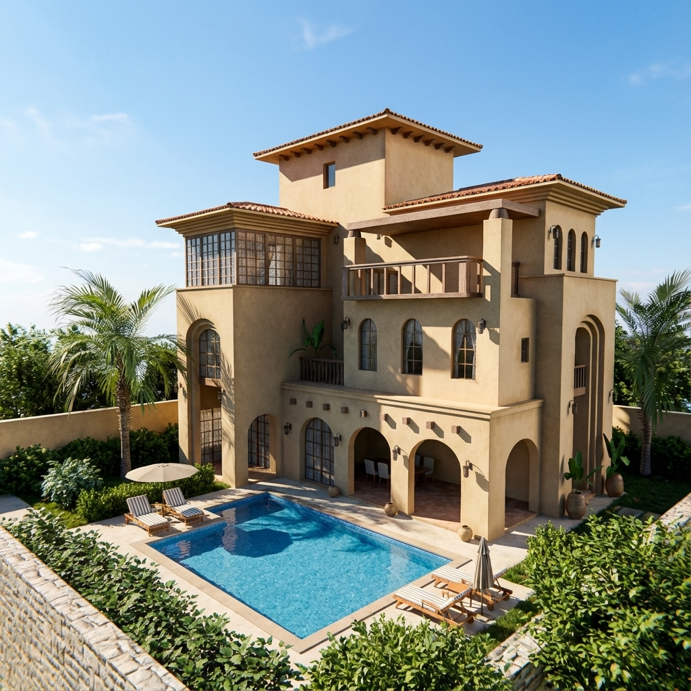
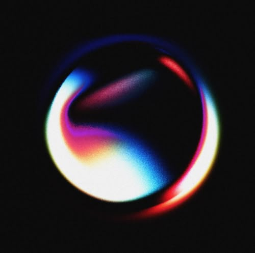
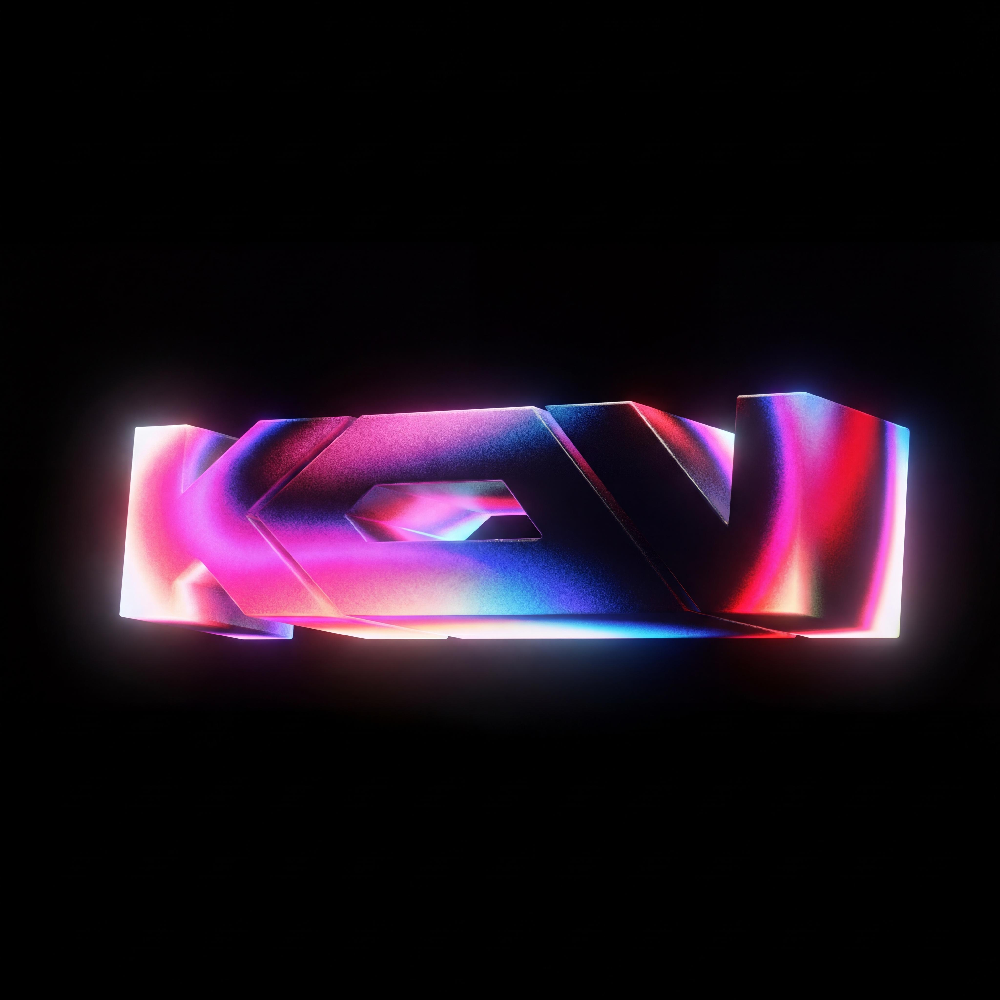
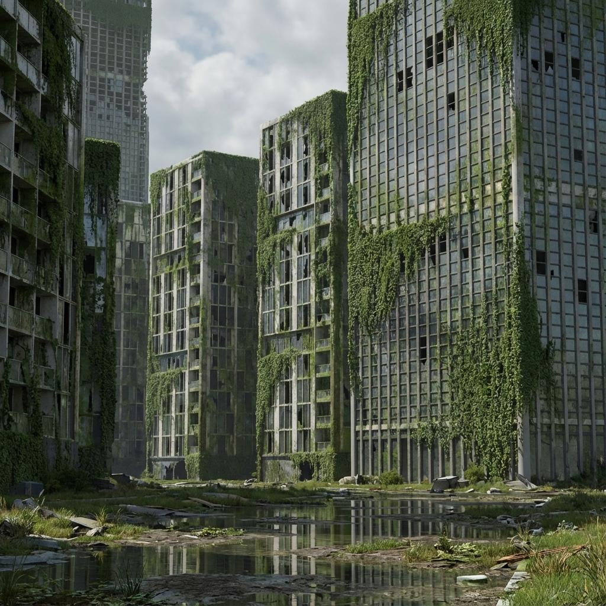
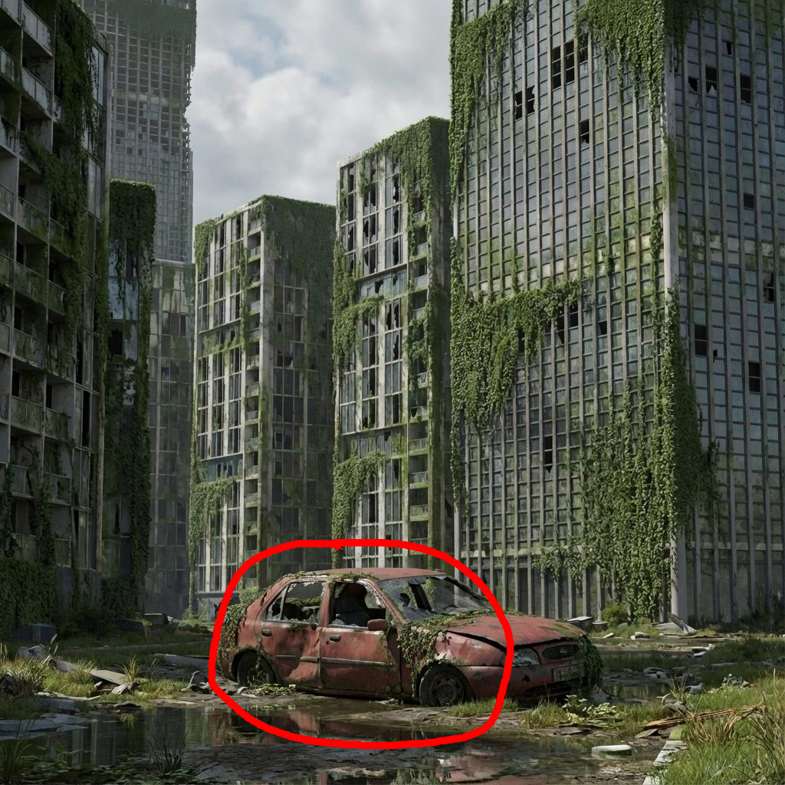
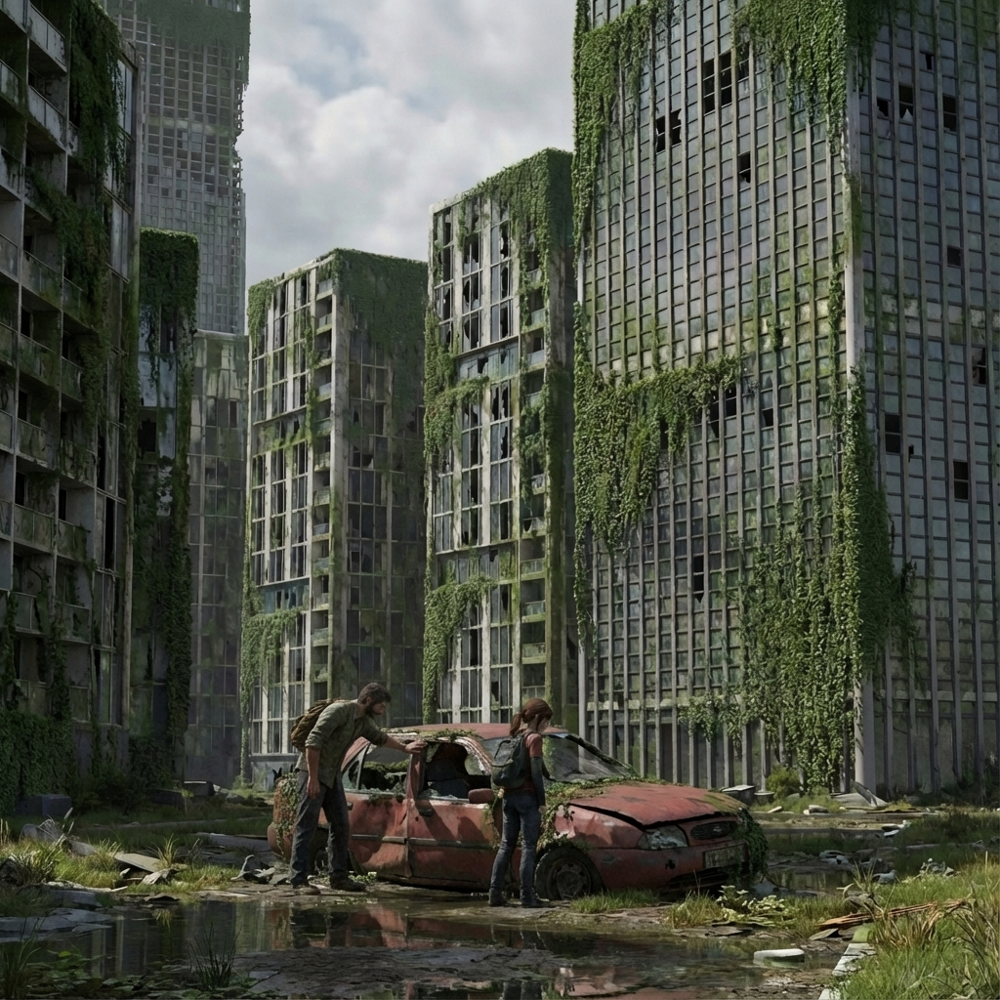
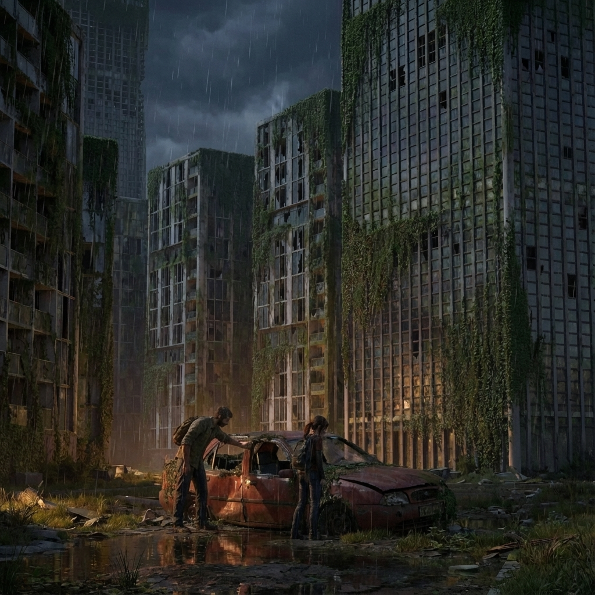

# 🍌 Nano Banana Pro Render

**Professional AI Rendering & Editing Suite for Blender**

Transform your Blender scenes into stunning photorealistic images using the latest **Google Gemini 3 Pro** AI. Now with full **Blender 5.0+ support**, **Intelligent Aspect Ratio Handling**, and **Secure API Integration**.

---

## What's New in v2.1

### 🚀 Blender 5.0 & Eevee Next Support
Fully compatible with the latest Blender 5.0 release and the new Eevee Next rendering engine. The addon automatically detects your version and optimizes the workflow accordingly.

### 📐 Intelligent Aspect Ratio
Say goodbye to square crops! Nano Banana Pro now respects your scene's aspect ratio perfectly.
- **Auto-Detection**: The AI automatically matches your scene's proportions (16:9, 4:3, Portrait, etc.).
- **Smart Scaling**: Choose a base resolution (1K, 2K, 4K), and we'll scale it proportionally to fit your composition.

### 🔒 Enhanced Security
Your API keys are now safer than ever.
- **Secure Storage**: API keys are stored in Blender Preferences or Environment Variables (`GEMINI_API_KEY`).
- **No Leaks**: Keys are never saved inside `.blend` files, making it safe to share your project files.

### 💾 Persistent History
Never lose a render again. The new history guard system ensures your generated images are preserved in memory even if not immediately saved to disk.

### 🧠 Structured Semantic Prompting (New Architecture)
We've completely rewritten the core to be leaner and faster.
- **JSON Technical Specs**: Instead of "talking" to the AI, we now send strict JSON technical specifications.
- **Token Economy**: Optimized code removes fluff, saving tokens and speeding up generation.
- **Zero Hallucinations**: Strict context isolation ensures the AI follows instructions with surgical precision.

---

## Interface

### The Render Panel & Editor Studio

|            Render Panel             |             Editor Studio             |
| :---------------------------------: | :-----------------------------------: |
|  |  |

_Simple controls for generation, powerful tools for editing._

---

## Core Features

### 1. The Render Engine (3D View)

Turn simple geometry into finished art.

- **Depth Map Render (Mist)**: Use a simple mist pass to define geometry, let AI handle the rest. Perfect for rapid concepting from blockouts.
- **Regular Render (Image-to-Image)**: Enhance your existing Eevee/Cycles renders with AI magic. Use a prompt to change the style, lighting, or details of your scene while keeping the original composition.
- **Style Transfer**: Apply the exact look/feel of _any_ reference image to your scene.

### 2. The Studio (Image Editor)

Refine and perfect your results.

- **Object Integration**: Add people, furniture, or effects that perfectly match your scene's lighting.
- **Iterative Workflow**: Make change after change until it's perfect.
- **History System**: Jump back to any previous state instantly.

---

## Workflow Guide

### Part 1: Generating the Base

_Located in 3D View > N-Panel > Nano Banana Pro_

1.  **Set Up Scene**: Block out your shapes. No need for complex materials.
2.  **Choose Resolution**: Select **1K**, **2K**, or **4K**. The aspect ratio will match your scene automatically.
3.  **Add Style (Optional)**: Load a reference image to define the mood.
4.  **Render**: Click "Generate AI Render".

### Part 2: Refining & Inpainting

_Located in Image Editor > N-Panel > Nano Banana Pro Edit_

1.  **Open Image**: Your render automatically opens here.
2.  **Inpaint (Optional)**:
    - Click **"Inpainting"**.
    - Click **"Draw"** and paint over the area you want to change.
    - Type a prompt (e.g., "add a red sports car").
    - Click **"Render"**.
3.  **Integrate Object (Optional)**:
    - Enable **"Reference Image"** and load a photo of an object (e.g., a specific chair).
    - Use **"Inpainting"** to draw a mask where you want it.
    - Prompt: "Integrate this object here".
    - Click **"Render"**.
4.  **Edit Whole Image**:
    - Type a prompt (e.g., "make it night time", "add rain").
    - Click **"Apply AI Edit"**.

---

## Examples

### 1. Depth Map Mode

Turn blockouts into art using Mist Pass

**With Style Reference**
Uses geometry + reference image style
| Depth Input | Style Reference | Result |
| :---: | :---: | :---: |
|  |  |  |

**Without Style Reference**
Uses geometry + text prompt only
| Depth Input | Text Prompt | Result |
| :---: | :---: | :---: |
|  | "Make it ultra realistic, like a photo taken on an iPhone" |  |

### 2. Regular Render Mode

Enhance existing Eevee/Cycles renders

**With Style Reference**
Transfer style while keeping exact composition
| Original Render | Style Reference | Result |
| :---: | :---: | :---: |
|  |  |  |

**Without Style Reference**
Change lighting/mood with text
| Step | Content |
| :--- | :--- |
| **Original** |  |
| **Prompt** | "Make the scene photorealistic with dark atmospheric lighting, a stormy sky, wet rock textures, and replace the character with a knight." |
| **Result** |  |

### 3. AI Editor Studio

Post-processing magic

**Inpainting (Add Object)**
Draw mask + Prompt
| Original | Mask | Prompt | Result |
| :---: | :---: | :---: | :---: |
|  |  | "Add a red car" |  |

**Object Integration**
Draw mask + Reference Image + Prompt
| Original | Mask | Reference Object | Result |
| :---: | :---: | :---: | :---: |
|  |  |  |  |

**Full Image Edit**
Prompt only (no mask)
| Original | Prompt | Result |
| :---: | :---: | :---: |
|  | "Make it night time, raining" |  |

---

## Installation & Setup

1.  **Get API Key**: Visit [Google AI Studio](https://aistudio.google.com/) and create a free API key.
2.  **Download**: Get the latest `.zip` from [Releases](https://github.com/kovname/nano-banana-render/releases).
3.  **Install**: In Blender, go to `Edit > Preferences > Add-ons > Install...` and select the zip.
4.  **Configure**:
    - Go to Add-on Preferences (expand the addon details).
    - Paste your API key in the `Gemini API Key` field.
    - *Alternatively, set a `GEMINI_API_KEY` environment variable on your system.*

> **Note**: Google provides a generous free tier for the Gemini API, but you **must enable billing** in Google Cloud Console to access the Gemini 3 Pro model used by this addon.

---

## Contributing

Found a bug? Want a feature? [Open an issue!](https://github.com/kovname/nano-banana-render/issues)

Share your renders and let's make this better together!

---

 

**Made with 🍌 by Kovname**

[Star](https://github.com/kovname/nano-banana-render) • [Download](https://github.com/kovname/nano-banana-render/releases) • [Issues](https://github.com/kovname/nano-banana-render/issues)

