# 🍌 Nano Banana Render

**The First Generative Pipeline for Blender — Rendering & Texturing.**

Nano Banana integrates seamlessly into Blender as a **standalone render engine** alongside Cycles and Eevee. Select it from the render engine dropdown and start generating photorealistic images from simple blockouts, depth maps, or existing renders — powered by **Google Gemini AI**. 

With this major release, we've gone beyond rendering: introducing **Nanode AI Texturing** for seamless 3D material generation.

  <a href="https://nanode.tech">🌐 nanode.tech</a> •
  <a href="https://github.com/kovname/nano-banana-render/releases">📦 Download</a> •
  <a href="https://github.com/kovname/nano-banana-render/issues">🐛 Report Bug</a>

---

## 🚀 What's New in v2.6.0?

The complete generative pipeline is here. 

- **💳 Nanode Store:** Our centralized account and payment system is live! No more API keys to juggle. Login with Google, get free credits, and securely purchase more credits.
- **🎨 AI Texturing (Beta):** Project AI-generated seamless materials right onto your 3D models.
- **🔄 Auto-Updater:** Never manually install zip files again. Nanode automatically checks for updates and installs the latest features and bug fixes.
- **🧠 Enhanced Prompt Engineering:** Client-side prompt building strictly prevents hallucination, ensuring AI respects your geometry, masks, and boundaries.

---

## Supported by Google Cloud for Startups

  

This project is proudly supported by the **Google Cloud for Startups** program. Their generous cloud credits made it possible for us to build the heavy AI infrastructure bridging Blender to Google's Gemini models. A huge thank you to Google Cloud for believing in independent creators and open-source tools! 🙏

---

## 🛠️ The Pipeline Components

We've completely rebuilt the architecture. Nanode provides three central workflows:

### 1️ 🎬 Render Engine (3D Viewport)
- **Depth Map Render (Mist)** — Block out basic shapes, let AI create photorealistic results perfectly respecting your geometry.
- **Regular Render (Eevee)** — Enhance Eevee renders with AI to add intricate details.
- **Style Transfer** — Apply the look, lighting, and palette of any reference image to your scene.
- **Resolution Control** — Generate in 1K, 2K, or 4K with automatic aspect ratio preservation.

### 2️ 🎨 Nanode AI Texturing (Beta)
- **Smart Material Generation** — Generate seamless textures directly onto your models inside the 3D viewport.
- **Multi-Angle Projection** — AI automatically sets up and projects textures from multiple camera angles to cover complex geometry.
- **Style References** — Match texturing to a specific style via image references.

### 3️ ✏️ Nanode AI Editor (Image Editor)
- **Inpainting** — Draw a mask directly in Blender, describe what to add (e.g. "Add a red car"), and the AI perfectly integrates it.
- **Object Integration** — Place reference objects into scenes with matched lighting and shadows.
- **Full Image Edit** — Change mood, time of day, weather using text prompts.
- **Compositing Polish** — One-click "Finalize Composite" to seamlessly blend edited zones.

---

## 📖 Getting Started

### 1. Install & Access
1. Download the `.zip` from [Releases](https://github.com/kovname/nano-banana-render/releases) and install via `Edit > Preferences > Add-ons > Install from disk`.
2. Enable **Nanode AI Render Engine**.
3. Go to the active Render tab, select **Nano Banana**, and click **Login with Google** to receive **100 free credits upon signup**.

### 2. Using the AI Render Engine
1. Select **Nano Banana** from the render engine dropdown.
2. Build your scene.
3. Open the **Render Properties** tab -> write your prompt describing the final vision. select reference image (optional)
4. Select render type **Depth Map Render (Mist)**, **Regular Render (Eevee)**
5. Press **F12** or click **Render > Image Render**. Render is done!

### 3. Using Nanode AI Texturing (Beta)
*Accessible via the 3D Viewport N-Panel (press `N` > Nanode AI Texturing (Beta)).*
1. Select the main object you want to texture.
2. Click **Init Cameras** to surround your object with AI projection cameras.
3. Type your prompt (e.g. "rusty metal surface with peeling blue paint").
4. Click **Generate Draft** to project the textures.

### 4. Using Nanode AI Editor
*Accessible in the Image Editor space (press `N` in Image Editor).*
1. Select your rendered image. Open the **Nanode AI Editor** panel in the sidebar.
2. **For Inpainting:** Click **Draw**, paint over the area you want to change, type what to add (or load a Reference Object), and click **Apply Drawing**.
3. **For Global Edits:** Type a prompt and hit **Render** to change the entire atmosphere.

---

## 📸 Showcase & Examples

### 1. Depth Map Render (Mist)
Depth map render is a render type that uses the depth map of the scene to create a render.
| Depth Input | Prompt | Result |
| :---: | :---: | :---: |
|  | *"Ultra realistic, middle ages, knight defending himself from arrows, beautiful lighting, light fog, motion blur, night time, fire forrest"* |  |

### 2. Depth Map Render (Mist) + Style Reference
Style reference is used to create a render with the same style as the reference image.
| Depth Input | Style Reference | Result |
| :---: | :---: | :---: |
|  | 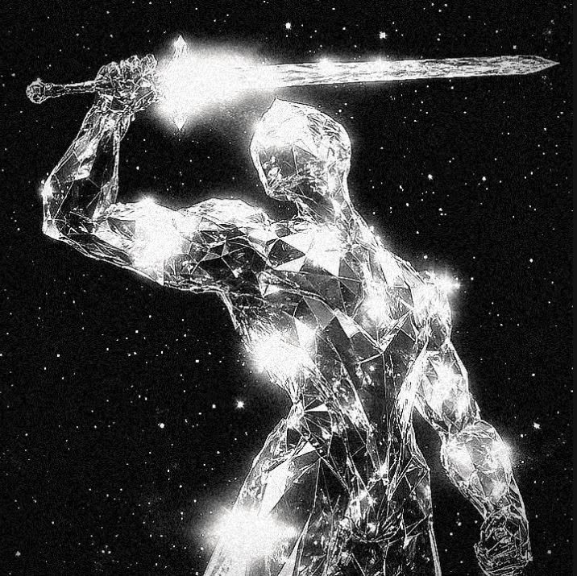 | 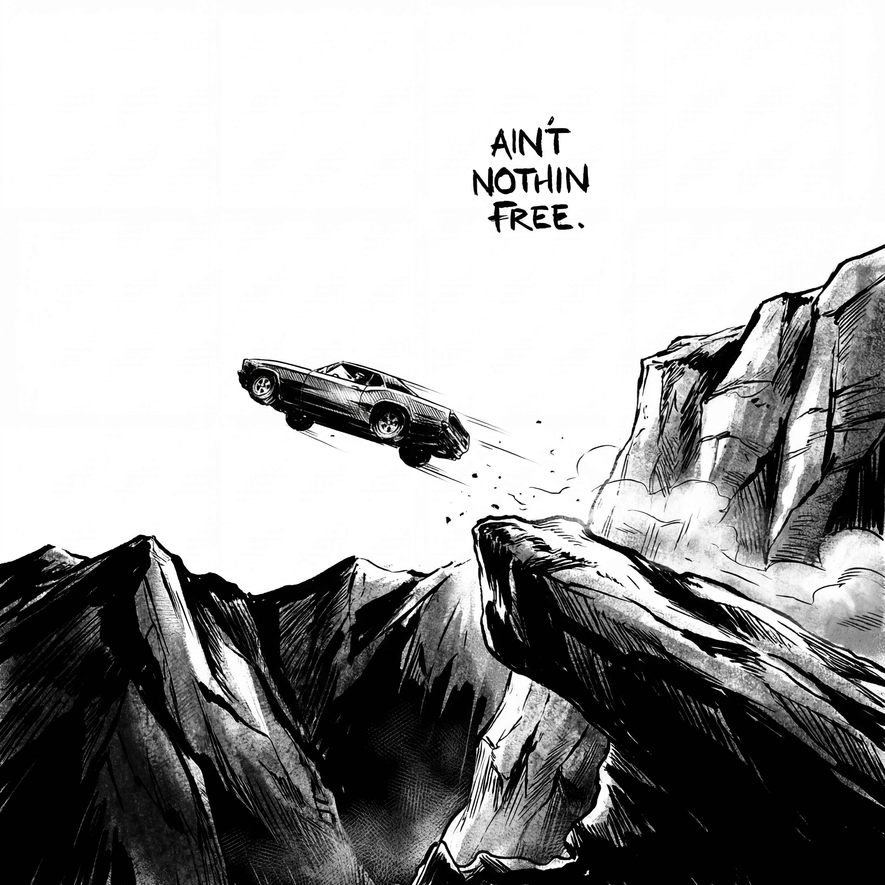 |

### 3. Regular Render (Eevee)
Regular render is a render type that uses the eevee render of the scene to create a more detailed render.
| Eevee Draft | Prompt | Result |
| :---: | :---: | :---: |
| 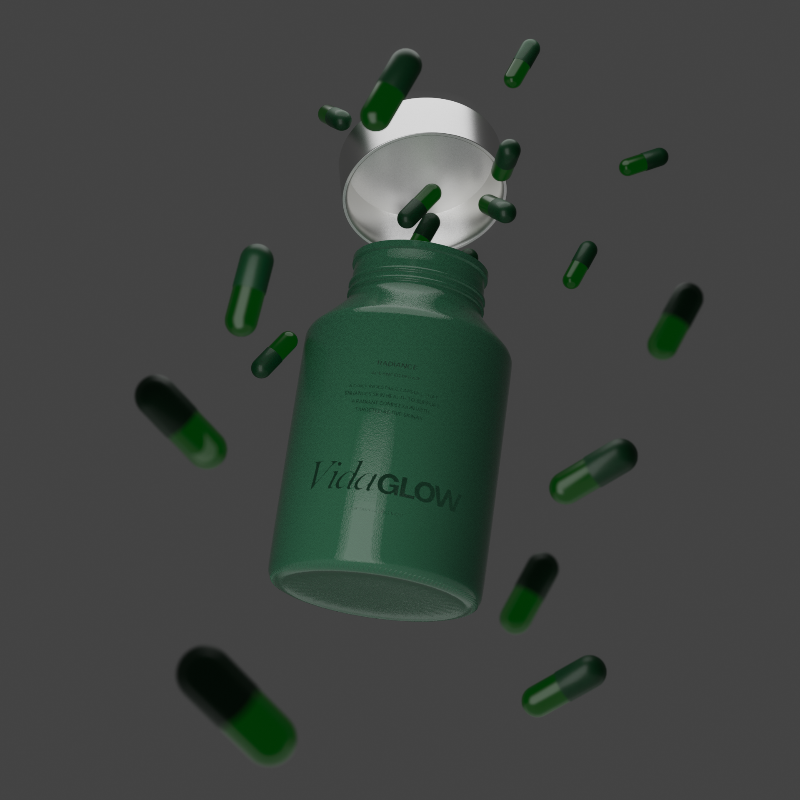 | *"Photorealistic advertising, interesting background, beautiful light"* | 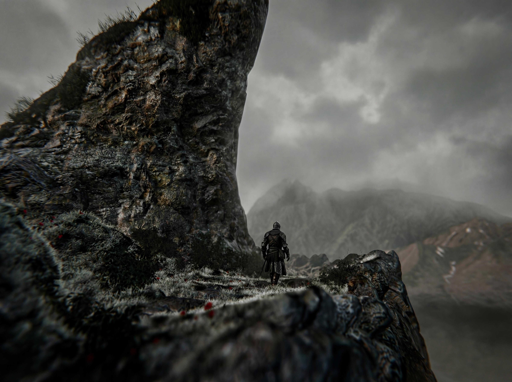 |

### 4. Regular Render (Eevee) + Style Reference
Style reference is used to create a render with the same style as the reference image.
| Eevee Draft | Style Reference | Result |
| :---: | :---: | :---: |
| 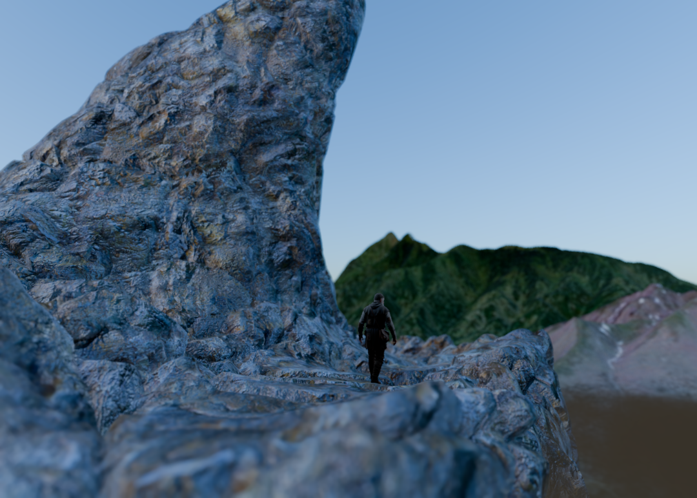 | 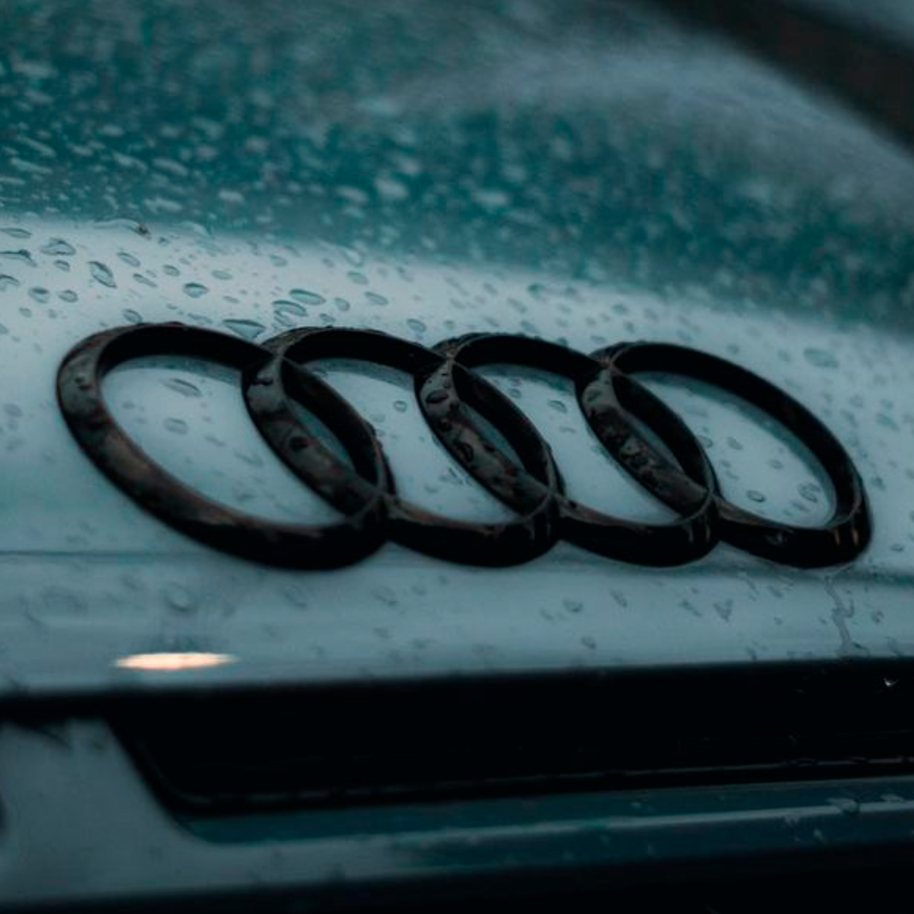 |  |

### 5. Texturing
Apply incredible, context-aware textures directly onto your models.
| Plain Object | Prompt / Style | Textured Object |
| :---: | :---: | :---: |
| 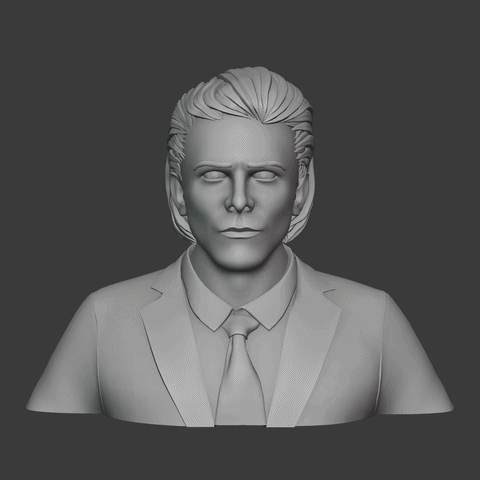 | *"Arcane style, man in jacket, red tie, scar on face"* |  |

### 6. Inpainting
Draw a mask and the Nanode Editor will inpaint it with matched lighting and shadows.
| Mask | Prompt | Result |
| :---: | :---: | :---: |
| 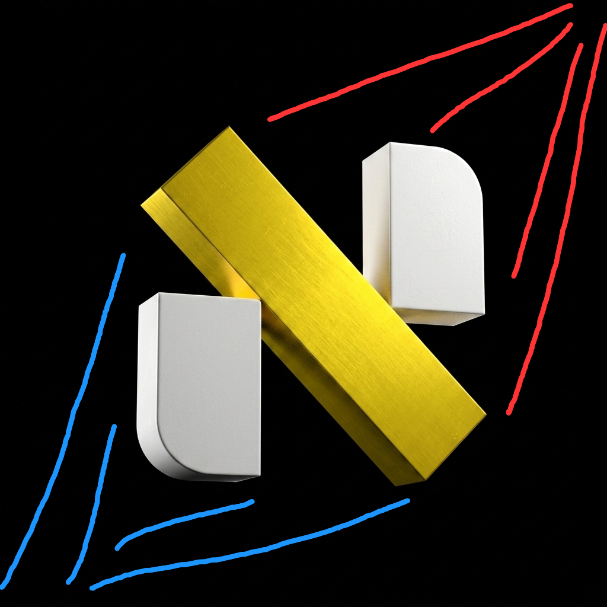 | *"Add spot light"* | 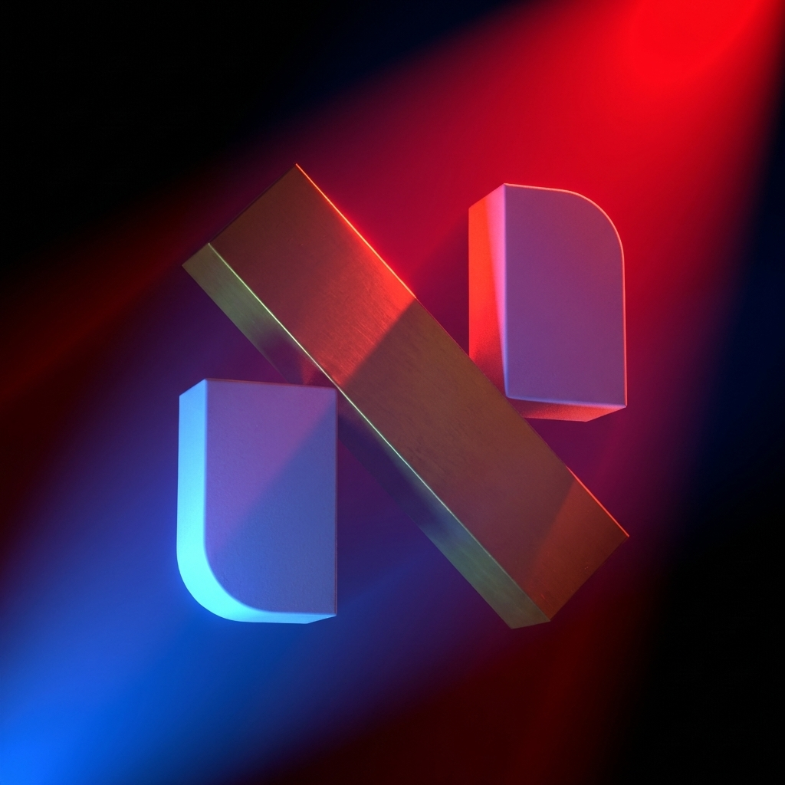 |

### 7. AI Image Editor
Global edit your image with prompt 
| Original | Prompt | Result |
| :---: | :---: | :---: |
| 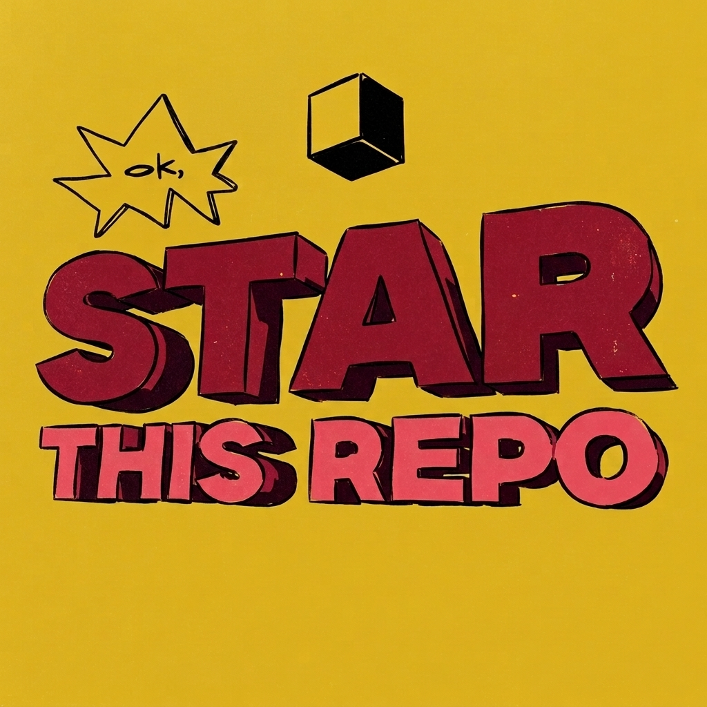 | *"Make the background blue and the text green, add some stars"* | 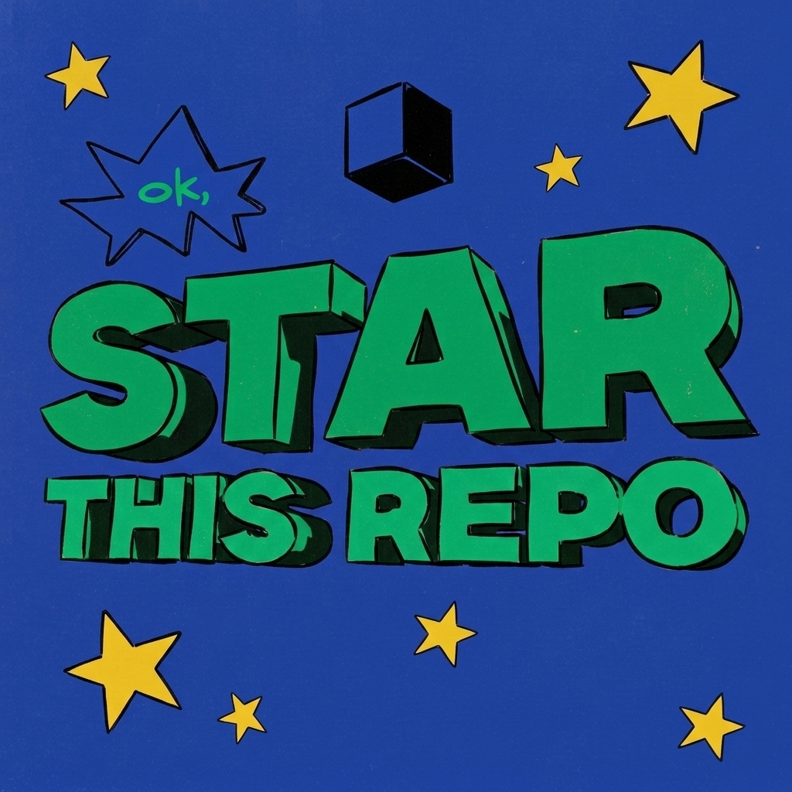 |
---

## 💸 Credits & Pricing

Generating heavy AI image pipelines requires massive server resources, but we strive to keep it incredibly accessible.

- ✅ **Free Tier:** 100 Free Credits upon logging in with your Google account.
- ✅ **Bonus Credits:** Earn +50 Credits anytime by submitting feedback using the in-addon feedback button.
- ✅ **Store Live:** Run out of credits? You can securely purchase top-up bundles via [nanode.tech](https://nanode.tech/pricing) — directly linked to your Blender addon.

---

## 🐛 Feedback & Bug Reports

Found a bug? Have an idea? We need your help to make this better!

- **In-addon Feedback** — Click the **Feedback** button in the editor panel.
- **GitHub Issues** — [Open an issue](https://github.com/kovname/nano-banana-render/issues) for detailed bug reports
- **Email** — Reach us at **contact@nanode.tech**

Every piece of feedback helps shape the future of Nanode. We read absolutely everything. 🍌

---

## ❤️ Support the Project

If you find Nanode useful, the absolute best way to support us is:

⭐ **[Star this repo](https://github.com/kovname/nano-banana-render)** — it helps others discover the project, boosts our algorithm ranking, and motivates us to keep building!

---

**Made with 🍌 by [Kovname](https://github.com/kovname)**

[⭐ Star](https://github.com/kovname/nano-banana-render) • [📦 Download](https://github.com/kovname/nano-banana-render/releases) • [🐛 Issues](https://github.com/kovname/nano-banana-render/issues) • [🌐 nanode.tech](https://nanode.tech)

