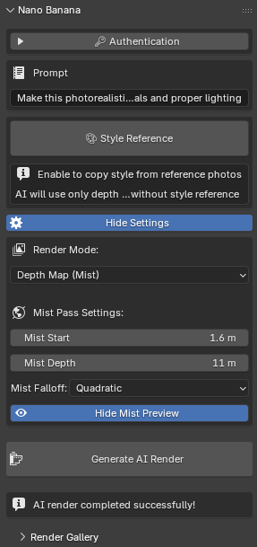
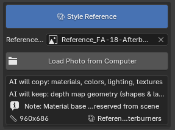

# 🍌 Nano Banana Render

**Transform your Blender scenes into stunning AI-rendered images**

Turn simple depth maps or existing renders into photorealistic images using Google Gemini AI. No complex materials or lighting setup required.

---

## ✨ Features

### 🎨 Two Render Modes
- **Depth Map (Mist)** - Pure geometry, AI creates everything else
- **Regular Render** - Enhance existing Eevee renders with AI

### 🖼️ Style References
- Apply visual style from any reference image
- Maintain consistent look across renders

### 📚 Render History
- Copy previous prompts and styles
- Gallery of all renders

### ⚙️ Mist Controls
- Adjust Start, Depth, and Falloff
- Real-time viewport preview

---

## 📸 Screenshots

### Interface

### Styles

### Render History

---

## 🎯 Examples

### Depth Map Mode (With Style Reference)

| Depth Map | Style Reference | AI Result |
|-----------|----------------|-----------|
| *docs/images/depth_1.png* | *docs/images/style_1.png* | *docs/images/result_1.png* |

| Depth Map | Style Reference | AI Result |
|-----------|----------------|-----------|
| *docs/images/depth_2.png* | *docs/images/style_2.png* | *docs/images/result_2.png* |

### Depth Map Mode (Without Style Reference)

| Depth Map | AI Result |
|-----------|-----------|
| *docs/images/depth_1.png* | *docs/images/result_11.png* |

| Depth Map | AI Result |
|-----------|-----------|
| *docs/images/depth_2.png* | *docs/images/result_11.png* |

### Regular Render Mode (With Style)

| Eevee Render | Style Reference | AI Result |
|--------------|----------------|-----------|
| *docs/images/eevee_1.png* | *docs/images/style_eevee_1.png* | *docs/images/result_eevee_1.png* |

| Eevee Render | Style Reference | AI Result |
|--------------|----------------|-----------|
| *docs/images/eevee_2.png* | *docs/images/style_eevee_2.png* | *docs/images/result_eevee_2.png* |

### Regular Render Mode (Without Style)

| Eevee Render | AI Result |
|--------------|-----------|
| *docs/images/eevee_1.png* | *docs/images/result_eevee_11.png* |

| Eevee Render | AI Result |
|--------------|-----------|
| *docs/images/eevee_2.png* | *docs/images/result_eevee_22.png* |

---

## 🚀 Setup

1. **Get API Key:** [Google AI Studio](https://aistudio.google.com/)
2. **Install addon** in Blender
3. **Enter API key** in addon preferences
4. **Start rendering!**

### ⚠️ Important
- **Free tier:** Google gives $300 credit (90 days) - essentially free!
- **Billing required:** Enable billing in Google Cloud Console for the API to work

---

## ⚙️ Performance

### Render Time
- **Local render:** (depends on your hardware)
- **AI processing:** 10-30 seconds (depends on Google server load)
- **Total:** Usually under 10 seconds

### Tips
- First render may take longer (dependencies loading)
- Multiple iterations may be needed for perfect results
- AI results can vary - iterate if needed!

---

## 🐛 Common Issues

### "API Key Invalid"
- Check key from [Google AI Studio](https://aistudio.google.com/)
- **Enable billing** in Google Cloud Console ($300 free credit)
- Google servers may be busy
- Wait a moment and try again

### Unexpected Results
- AI is creative and unpredictable
- Try multiple generations
- Adjust prompt for better control
- Experiment with different style references

---

## 🤝 Contributing

Found a bug? Want a feature? [Open an issue!](https://github.com/kovname/nano-banana-render/issues)

Share your renders and let's make this better together! 🎨

---

## 📄 License

MIT License - See [LICENSE](LICENSE) file

---

**Made with 🍌 by Kovname**

[⭐ Star](https://github.com/kovname/nano-banana-render) • [📥 Download](https://github.com/kovname/nano-banana-render/releases) • [🐛 Issues](https://github.com/kovname/nano-banana-render/issues)

